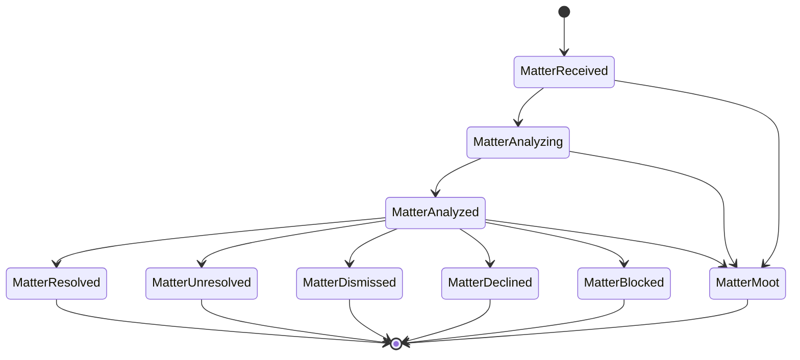

# Matter dispositions

## Why terminal dispositions matter

Half-dead issues resurface every planning cycle when closure was never recorded. Memolok treats an
honest refusal to act as valuable epistemology, not ticket hygiene — *"we chose not to, and here is
who said so and why"* is a real answer.

## The six terminal dispositions

| Disposition | Record minted? | The story it tells |
| --- | --- | --- |
| **Resolved** | Yes | A decision was made and later confirmed by what happened |
| **Unresolved** | Yes | Cause could not be identified, or information was insufficient |
| **Declined** | Yes | A valid, actionable matter the organization committed not to address |
| **Blocked** | Yes | We know what to do; an external constraint prevents it |
| **Dismissed** | No | Analysis concluded nothing warranted a decision |
| **Moot** | Irrelevant | The world removed the matter before closure |

**Declined versus Blocked.** Both need an Accepted record with a Verdict and an accountable decider.
Declined is organizational will — the matter holds up, and someone decided against acting on it
anyway. Blocked is an external gate, and it has a recovery path when the constraint lifts.

**Declined versus Dismissed.** Declined means the matter was worth acting on and will not be acted
on. Dismissed means analysis found nothing worth deciding. Do not use one for the other; they answer
different questions later.

**Moot** needs no analysis theatre — the customer sold the property, the product line was cancelled. It
is reachable from any non-terminal state and has **no recovery path**. If the subject returns later,
that is a new matter, not a reopening.

**Dismissed** is Path B, and it is the only one of the six reachable today.

## Full lifecycle

`MatterAnalyzed` is a **handoff state, not a terminal one**.

**Resolution is world evidence, not a decision.** A record commits to act; only an observed outcome
confirms Resolved. The decision freezes at t₀; resolution registers later.

## What is reachable today

| Transition | Tool |
| --- | --- |
| → `MatterReceived` | `register_matter` |
| → `MatterAnalyzing` → `MatterAnalyzed` | `create_analysis` with `producesDecision: true` |
| → `MatterDismissed` | `create_analysis` with `producesDecision: false` |

Resolved, Unresolved, Declined, Blocked, and Moot have no tool. Do not claim a matter reached one
of them, and do not invent fields for `resolvesMatter`, `declinesMatter`, `blocksResolutionOf`,
or `rendersMoot`.

Until those land: record refusal or blockage rationale in the **Verdict prose** of an Accepted record
at t₀. That captures the same governance content — the accountable decider and the reasoning — in a
place the ledger does support. The matter itself stays at `MatterAnalyzed`.

## Finding matters again

`list_matters(status="MatterReceived")` returns everything registered but never analyzed — the
unprocessed-bait inbox. `get_matter` fetches one by id.

A matter left at `MatterReceived` is not a failure state. It is the resting place of a
deliberately parked observation, which is what makes the **`save-matter`** drive-by journey work.
